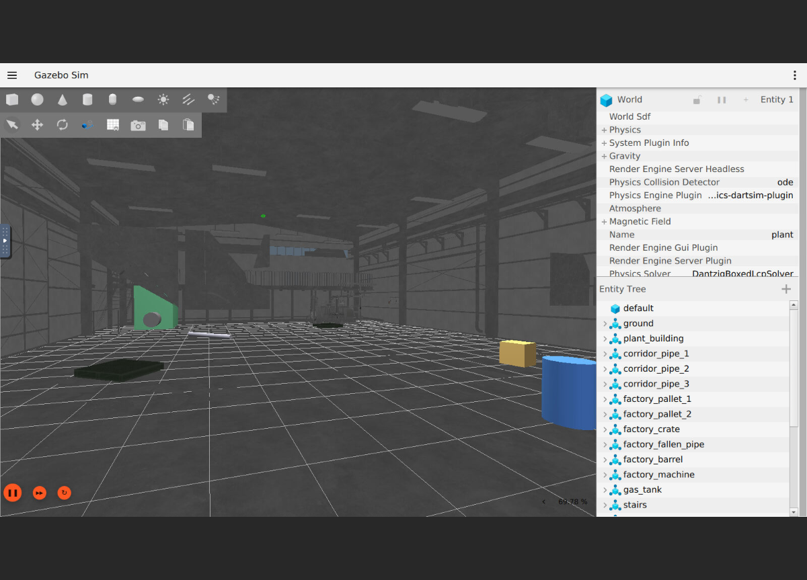

# 플랜트 4족 보행 로봇 Digital Twin

가상 발전소 환경(복도·공장·계단·험지)에서 4족 보행 로봇이 자율 주행하며
아날로그 계기 판독, 열화상 점검, 가스 누출원 추적, 자율 복귀를 수행하고
웹 관제 대시보드로 실시간 감시하는 Digital Twin 시스템.

- 과제 요구사항: [docs/REQUIREMENTS.md](docs/REQUIREMENTS.md)
- 프로젝트 계획: [docs/PLAN.md](docs/PLAN.md)
- **프로젝트 보고서: [docs/REPORT.md](docs/REPORT.md)**
- 통신 구조: [docs/ARCHITECTURE.md](docs/ARCHITECTURE.md)
- 동료평가·심층 인터뷰 답변: [docs/INTERVIEW.md](docs/INTERVIEW.md)

## 빠른 시작 — 통합 데모

```bash
cd docker && docker compose build            # 최초 1회 (10~20분)
docker compose run --rm --no-deps --service-ports sim bash -c \
  "source /opt/ros/jazzy/setup.bash && \
   ros2 launch /ws/src/plant_dt/simulation/launch/plant_dt.launch.py \
     mission:=true rth_start_pct:=50.0"
# 브라우저에서 dashboard/index.html 열기 (rosbridge ws://localhost:9090)
# → 복도 순찰 → 게이지 판독 → 공장 이동 → 배터리 20% → 자율 복귀 도킹
```

## 제공 3D 에셋 적용 (Gazebo)

과제 제공 에셋(`Doosanenerbility.zip`, Unity `.unitypackage`)의 FBX를 Gazebo용 OBJ로 변환해
월드의 **visual** 로 사용한다. 충돌 형상은 검증된 박스 그대로 유지하므로 물리·Nav2 동작은 바뀌지 않는다.

| 에셋 | 용도 | 배치 |
|---|---|---|
| `factory_inner_1` (Factory_03) | 공장 벽·지붕·트러스·창·바닥 | 박스 공장 25×18 에 중심 정렬 |
| `factory_hall` (Corridor_Wall_02) | 복도 벽·천장 조명·배관·문 | x 0.926 / y 0.92 스케일로 45×3.5 에 정렬 (벽 안쪽면 = 충돌면) |
| `fac_gastank` (Main_Machine_01) | 가스 탱크 | 0.45 배, 기존 실린더 위치 |
| `obs_palette` (Plastic_Pallet_01) | 공장 팔레트 장애물 2개 | 기존 박스 위치 |

변환 스크립트 `simulation/models/plant_assets/convert.py` (컨테이너 안에서 실행):

```bash
# 1) unitypackage 를 각각 tar 로 풀어 한 디렉토리에 모은다 (Mac)
for p in map/factory_hall map/factory_inner_1 object/fac_gastank object/obs_palette; do
  mkdir -p /tmp/pkg/$(basename $p) && tar -xzf $p.unitypackage -C /tmp/pkg/$(basename $p); done
docker cp /tmp/pkg plant-dt-sim:/tmp/pkg
# 2) 컨테이너 안: FBX → glb(assimp) → OBJ Z-up·m(trimesh) + Unity .mat 텍스처 매핑 + 경로 간섭 구간 절단
docker compose exec sim bash -c "pip install --break-system-packages trimesh pygltflib rtree && \
  apt-get install -y assimp-utils && cd /ws/src/plant_dt/simulation/models/plant_assets && \
  python3 convert.py /tmp/pkg meshes"
```

검증: 메시 배치 후 로봇 높이(0.4m)에서 미션 경유점 12곳에 레이캐스트 → 복도 벽 ±1.64m(충돌면과 일치),
공장 통로·기계·가스탱크 앞 장애물 없음. RTF 는 박스 월드와 동일 패턴(평균 ≈0.8). 
로봇 카메라(ogre2) 검증 캡처: `docs/images/verify_robot_camera.png` (OBJ 에 정점 법선이 없으면 ogre2 에서
흰색으로 렌더되므로 변환기가 정점 법선과 1024² 텍스처를 강제한다).
Spot 로봇 모델(삼각형 97만 개)과 Unity 전용 애니메이션·이펙트는 사용하지 않는다 (로봇은 Go2 URDF).



## Unity 디지털 트윈 뷰어 (`unity/PlantDigitalTwin`)

제공 에셋을 원본 그대로 쓰는 고품질 시각화 창구. Gazebo 가 물리·센서·자율주행을 담당하고,
Unity 는 ROS-TCP-Connector 로 로봇 포즈(`/model/go2/odometry`)를 받아 Spot 모델을 같은 위치에 그린다.
씬 배치는 Gazebo 월드와 동일 좌표(공장 중심 0,0 / 복도 x 12.5~57.5 / 가스탱크 -9,6 / 팔레트 -6,4·3,-5 / 스폰 55,0).

| 구성 | 내용 |
|---|---|
| Unity | 6000.0.68f1, High Definition 3D 템플릿 (에셋 가이드 지정 버전) |
| 씬 | `Assets/PlantDT/Scenes/PlantDigitalTwin.unity` — `PlantDT > Build Plant Scene` 메뉴로 재생성 |
| 스크립트 | `PlantSceneBuilder.cs`(배치·정렬), `PlantRosBridge.cs`(odometry 구독), `RobotPoseFollower.cs`(좌표 변환·보간) |
| ROS 측 | 컨테이너의 `ros_tcp_endpoint`(포트 10000, Dockerfile 에 빌드 포함) |

좌표 규약: Unity(x,y,z) = (−Gazebo.y, Gazebo.z, Gazebo.x), yaw 부호 반전 (ROS-TCP-Connector FLU→RUF 와 동일).

실행 순서:

```bash
# 1) 컨테이너: 시뮬레이션 + Unity 엔드포인트
cd docker && docker compose up -d
docker compose exec -d sim bash -c "source /opt/ros/jazzy/setup.bash && ros2 launch /ws/src/plant_dt/simulation/launch/plant_dt.launch.py mission:=true rth_start_pct:=50.0"
docker compose exec -d sim bash -c "source /opt/ros/jazzy/setup.bash && source /ws/install/setup.bash && ros2 run ros_tcp_endpoint default_server_endpoint --ros-args -p ROS_IP:=0.0.0.0 -p ROS_TCP_PORT:=10000"
# 2) Unity Hub 에서 unity/PlantDigitalTwin 열기 → PlantDigitalTwin 씬 → Play
#    (ROSConnection 오브젝트: 127.0.0.1:10000, 상단 HUD 가 초록이면 연결됨)
#    Spot 은 spot_move 클립을 실제 속도(보폭 0.97 m/s 기준)에 맞춰 재생 — 발 미끄러짐 없음
```

원본 모델 폴더 `Assets/00_Model`(262MB)은 git 에서 제외했다. 클론 후 `Doosanenerbility/Modeling` 의
unitypackage 9개를 임포트하면 프리팹 참조(GUID)가 그대로 복원된다.

## 기술 스택

| 영역 | 스택 |
|---|---|
| Robot OS | ROS 2 Jazzy + Nav2 |
| 시뮬레이터 | Gazebo Harmonic (Docker arm64 네이티브, GPU 불필요) |
| 언어 | Python (주력), C++ (MPC stage3) |
| AI/비전 | PyTorch, OpenCV |
| 시각화 | Foxglove Studio, noVNC, 웹 대시보드(rosbridge) |
| 실행 환경 | macOS + Docker (보너스 RL/클라우드 관제만 EC2 스팟) |

## 환경 설정 (Phase 0)

요구 사항: Docker Desktop, (권장) [Foxglove Studio](https://foxglove.dev/download) Mac 앱

```bash
cd docker
docker compose build          # 최초 1회, 10~20분 소요
docker compose up -d          # 컨테이너 기동
docker compose exec sim bash  # 개발 셸 진입
```

동작 확인 (자동 스모크 테스트):

```bash
docker compose run --rm --no-deps sim bash /ws/src/plant_dt/docker/smoke_test.sh
```

수동 확인:

```bash
# 컨테이너 셸 안에서 — Gazebo Harmonic 서버(headless) 실행
gz sim -s -r empty.sdf &
gz topic -l                            # Gazebo 토픽이 보이면 정상

# Foxglove 연결용 브리지
ros2 launch foxglove_bridge foxglove_bridge_launch.xml
# → Mac의 Foxglove Studio에서 ws://localhost:8765 접속
```

Gazebo GUI가 필요하면 컨테이너 셸에서 `bash /ws/src/plant_dt/docker/gui.sh --gz` 실행 후
브라우저에서 http://localhost:8080/vnc.html 접속 (sim 컨테이너 내장 noVNC, arm64 네이티브,
소프트웨어 렌더링). 검증 화면: [docs/images/gazebo_gui_novnc.png](docs/images/gazebo_gui_novnc.png)

## 레포지토리 구조

```
module1_locomotion/   # 험지 돌파 제어 (Elevation Map, MPC 3단계, Fall Recovery)
module2_inspection/   # 게이지 독해, 열화상 퓨전, 순찰 경로
module3_gas_safety/   # 가스 확산 시뮬, Source Seeking, 자율 복귀
simulation/           # Gazebo 월드·모델·launch (복도 45×3.5×4m, 공장 25×18×7m)
dashboard/            # Digital Twin 관제 대시보드
bonus/                # RL 보행, 다중 로봇, 클라우드 관제
docker/               # 개발 컨테이너 구성
docs/                 # 계획서·요구사항·보고서
```

## 모듈별 실행

> 각 Phase 완료 시 이 섹션에 실행 명령을 추가한다.

| 모듈 | 상태 | 실행 |
|---|---|---|
| Phase 0 환경 구축 | 완료 | 위 "환경 설정" 참조, 검증: `docker/smoke_test.sh` |
| Phase 1 Virtual Plant | 완료 | `ros2 launch /ws/src/plant_dt/simulation/launch/plant_sim.launch.py` (컨테이너 안) → Foxglove로 ws://localhost:8765 접속 |
| Module 1 Locomotion (stage1) | 완료 | 컨테이너에서 launch 후 `python3 module1_locomotion/stage1_gait_controller/gait_controller.py`, `.../terrain_mapping/elevation_map.py`, `.../fall_recovery/fall_recovery.py` 실행, `/cmd_vel`로 조종 |
| Module 1 MPC stage2 (LIP-MPC) | 완료 | launch 후 `python3 module1_locomotion/stage2_simple_mpc_py/mpc_node.py` — 게이트와 병행 실행, 튜닝 기록은 stage2_simple_mpc_py/TUNING.md |
| Module 1 MPC stage3 (C++ Convex) | 부분 완료 (도전 과제) | 토크 제어 기립·유지 실증, 빌드·실행: stage3_convex_mpc_cpp/STATUS.md |
| Module 2 Inspection AI | 완료 | launch 후 gauge_reader/plant_process/image_degrader, thermal_camera_sim/thermal_fusion 실행. 정확도: `eval_accuracy.py`, 순찰 경로: `patrol_planner.py` |
| Module 3 Gas/Safety | 완료 | 통합 launch에 포함, 상태: module3_gas_safety/STATUS.md |
| 보너스① 웹 대시보드 | 완료 | Phase 5 관제 화면과 통합 구현 |
| 보너스② 다중 로봇 협업 | 완료 | `python3 bonus/multi_robot/prepare_go2b.py` 후 `ros2 launch .../bonus/multi_robot/multi_robot.launch.py` — A=복도, B=공장 구역 분할 순찰 |
| 보너스③ RL 보행 / ④ 클라우드 관제 | 미착수 (EC2 필요) | PLAN.md §2.2 분기표 참조 |
| Phase 5 통합+관제 | 완료 | `ros2 launch .../plant_dt.launch.py mission:=true` + 브라우저로 dashboard/index.html (rosbridge :9090) |
